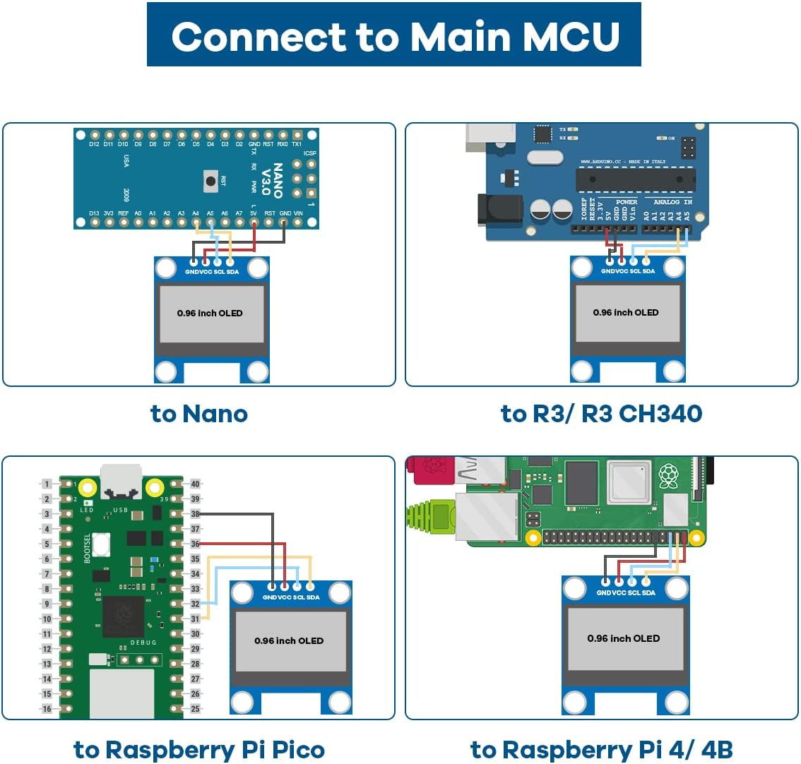

# CyanotypeExposureHelper

This is a tiny, shitty project helping me to properly expose Cyanotypes. The more sensible thing would be to just get a bunch of UV LEDs, and build an exposure "chamber". But that is too sensible for me. Instead I use the sun.

However the sun comes with certain issues. Like not having a constant output, because of time of day, season, or cloud coverage. I've had decent luck adjusting my exposure time by running tests on a bright sunny day with an UV Index of 8, writing down the required exposure, and multiply my exposure time by four on days with an UV Index of 2. Which makes sense, as the UV Index scale actually is linear, and correlates with the absolute amount of power in the UV. 

If it isn't clear yet, this relies on a (somewhat) cheap UV sensor that are designed to linearly correlate their output to the current UV Index. So the goal is to integrate (add) the current UV Index over time (every half second or so), until a certain cumulative exposure is reached. For this I am coining the unit "UV Index Seconds" \[UVs\], and I'm pulling the (adjustable) target value of 1500 UVs out of my arse. (Admittedly, that probably is on the high side, I suspect 1350 UVs might be a better initial value, but maybe you are fancy and put a some protective transparent element over the sensor, the error should just be a linear offset.)

## Required Hardware

 - Any old (or new) Arduino, I used an Arduino Nano clone I had laying around. 
 - [A UV Sensor, I used this specific one](https://paradisetronic.com/products/uv-lichtsensor-guva-s12sd-analogem-ausgang-3-5v-240-370nm)
 - A display, I used an GME12864-11
 - Three buttons
 - A beeper
 - Any supporting hardware you wish (I used a cheap batter, charger, and boost converter, to be guaranteed 5V)

## Usage

Figure out how to assemble this mess of wires and buttons into a coherent form (I graciously provided an enclosure you can 3D print). If I feel like it, I might even make a wiring diagram. But I'm sure you can figure it out! The one thing that isn't quite obvious is how to wire up the display, so here you go.

## FAQ
Q: Does it actually work?
A: I don't know, I haven't gotten around to test it yet.

Q: Why are you doing this instead of building an exposure chamber?
A: That sounds boring.

Q: This documentation sucks, your code sucks and you should do something else with your time.
A: That's not a question.
